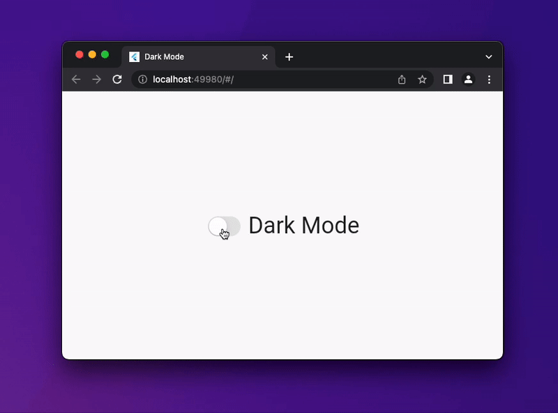

# Flutter Dark Mode Switch

A simple switch to turn on dark mode.



```dart
CupertinoSwitch(
    activeColor: Colors.pinkAccent,
    onChanged: (_) {
        setState(() {
            _themeNotifier.switchTheme();
        });
    },
    value: _themeNotifier.currentTheme() == ThemeMode.dark,
)
```

## Youtube
https://www.youtube.com/channel/UCZAxPaF-1No8qKaOEBfp97w/featured